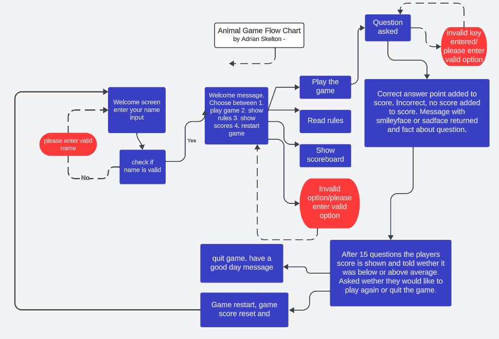

# ANIMAL QUIZ

Animal-Quiz is my third project for Code Institute Full Stack development program. 

The inspiration for the game came from my two children Axel and Hannah and their love for animal facts and the natural world in general. 

Visit the live site [here.](https://animalgame-470e463a9700.herokuapp.com/ "Link to animal quiz on heroku")

---

## CONTENTS

* [Project Overview](#project-overview)
  * [Project Goals](#project-goals)

* [User Experience](#user-experience)
  * [User Expectations](#user-expectations)
  * [User Stories](#user-stories)

* [Design](#design)
  * [Colour Scheme](#colour-scheme)
  * [Imagery](#imagery)
  * [Structure](#structure)
  * [Wireframes](#wireframes)

* [Features](#features)
  * [Intro](#intro)
  * [Name input](#name-input)
  * [Guide](#guide)
  * [Quiz](#quiz)
  * [More knowledge](#more-knowledge)
  * [Quiz end messages](#quiz-end-messages)
  * [Leaderboard update message and display](#leaderboard-update-message-and-display)
  * [Quiz replay](#quiz-replay)
  * [Front-end features](#front-end-features)

* [Future Implementations](#future-implementations)

* [Technologies Used](#technologies-used)
  * [Languages Used](#languages-used)
  * [Programs Used](#programs-used)

* [Deployment](#deployment)

* [Testing](#testing)

* [Credits](#credits)
  * [Code used and adapted](#code-used-and-adapted)
  * [Acknowledgments](#acknowledgments)

---

## **Project Overview**

### **Project Goals**
- Create a game in python
- Understand the concepts of the code written and how the code is executed
- Create data manipulation of an excel spreadsheet using gspread and python
- Have no bugs and if there are some have them documented

---

## **User Experience**
- Understand the purpose of the site
- Find out the rules of the game and have them easily understandable
- Have the game be fun and informative
- Give the full fact about the answer if answered correctly
- Have a scoring system where the player can see their score on the leaderboard 

### **User Expectations**
- I want to easily know what this site is for
- I want to easily and clearly navigate through the site
- If I need help it is easily available
- I want to see what my score was at the end of the game
- I want to enjoy the game and learn something new

### **User Stories**

---

## **Design**

### **Colour Scheme**

### **Imagery**

Background cameleon image from pexels.com

### **Structure**

 
### **Wireframes**

Due to the nature of the project being mostly backend no wireframes were made or needed.

---

## **Features**

### **Intro with name input**

### **Guide**

### **Quiz**

### **Facts after guess**

### **Quiz end messages** 

### **Leaderboard**

### **Front-end features**

---

## **Future Implementations**

---

## **Technologies Used**

### **Languages Used**

### **Programs Used**

---

## **Deployment**

The project was deployed on github, the command 'python3 run.py' was used in terminal to launch the game and once there was a good enough portion of the game written it was then deployed on heroku. The following steps were taken for deployment:

1. Add dependencies in GitPod to requirements.txt file with command "pip3 freeze > requirements.txt"
2. Commit and push to GitHub
3. Go to the Heroku Dashboard
4. Click "Create new app"
5. Name app and select location
5. Add Config Vars for Creds and Port in Settings tab
6. Add the buildbacks to Python and NodeJS in that order
7. Select appropriate deployment method, GitHub
8. Connect to Github and link to repository
9. Enable automatic deployment and/or deploy manually
10. Click on Deploy

---

## **Testing**

Colorama module was not working I thought it was not compatible with heroku but then realised it was not in the requirements.txt so ran command Pip Freeze > Requirements.txt
from terminal and pushed everything to heroku and it worked, solution found on code institute slack community.

---

## **Credits**

### **Code used and adapted**

### **Websites visited to gather knowledge**

Help with gsheets and getting data from excel [link here](https://www.youtube.com/watch?v=wrR0YLzh4DQ)\
Adding emojis [link here](https://www.makeuseof.com/how-to-include-emojis-in-your-python-code)\

###  **Acknowledgments**

[Back to top ⇧](#animal-quiz)

***

## Source code 

help sorting gspread by column.. https://stackoverflow.com/questions/50938274/sort-a-spread-sheet-via-gspread

