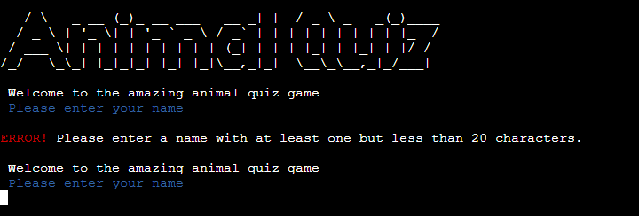
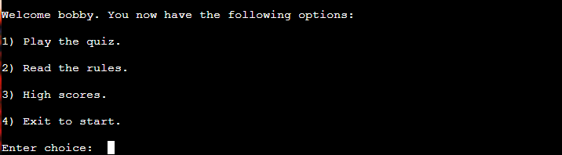
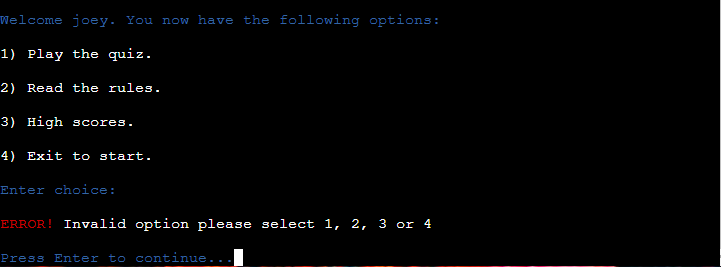
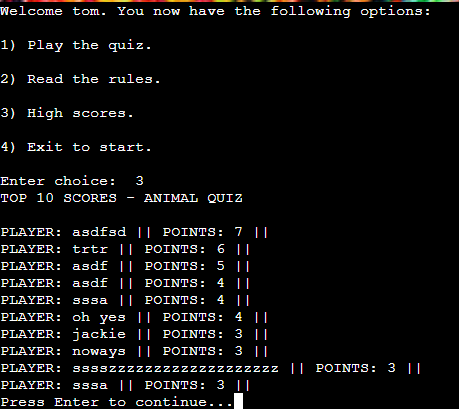

# ANIMAL QUIZ

Animal-Quiz is my third project for Code Institute Full Stack development program. 

The inspiration for the game came from my two children Axel and Hannah and their love for animal facts and the natural world in general. 

Visit the live site [here.](https://animalgame-470e463a9700.herokuapp.com/ "Link to animal quiz on heroku")

---

## CONTENTS

* [Project Overview](#project-overview)
  * [Project Goals](#project-goals)

* [User Experience](#user-experience)
  * [User Expectations](#user-expectations)
  * [User Stories](#user-stories)

* [Design](#design)
  * [Imagery](#imagery)
  * [Structure](#structure)
  * [Wireframes](#wireframes)

* [Features](#features)
  * [Intro](#intro)
  * [Name input](#name-input)
  * [Guide](#guide)
  * [Quiz](#quiz)
  * [More knowledge](#more-knowledge)
  * [Quiz end messages](#quiz-end-messages)
  * [Leaderboard update message and display](#leaderboard-update-message-and-display)
  * [Quiz replay](#quiz-replay)
  * [Front-end features](#front-end-features)

* [Future Implementations](#future-implementations)

* [Technologies Used](#technologies-used)
  * [Languages Used](#languages-used)
  * [Programs Used](#programs-used)

* [Deployment](#deployment)

* [Testing](#testing)

* [Credits](#credits)
  * [Code used and adapted](#code-used-and-adapted)
  * [Acknowledgments](#acknowledgments)

---

## **Project Overview**

### **Project Goals**
- Create a game in python
- Understand the concepts of the code written and how the code is executed
- Create data manipulation of an excel spreadsheet using gspread and python
- Have no bugs and if there are some have them documented

---

## **User Experience**
- Understand the purpose of the site
- Find out the rules of the game and have them easy to understand
- Have the game be fun and informative
- Give the full facts about the answer if answered correctly
- Have a scoring system where the player can see their score on the leader-board 

### **User Expectations**
- I want to easily know what this site is for
- I want to easily and clearly navigate through the site
- If I need help it is easily available
- I want to see what my score was at the end of the game
- I want to enjoy the game and learn something new

### **User Stories**

- As a user I want an easy to understand game
- As a user I want to be able to see what I scored at the end of the game
- As a user I would like to learn something new playing the game
- As a user I would like to see the scoreboard to know how I placed against others

---

## **Design**

The game was designed to look a bit brighter and livelier than just a terminal screen so I chose a nice royalty free background from pexels.com.
I also added some colours to the text with colorama and happy and sad emojis for if the user got something correct or incorrect.

### **Imagery**

Background chameleon image from pexels.com

### **Structure**

THIS IMAGE WILL BE UPDATED PLACEHOLDER

 
### **Wireframes**

Due to the nature of the project being mostly backend no wireframes were made or needed.

### **Design process**
- Colorama helped the output of the terminal. Green was used for correct inputs and answers.
Yellow was used for headings of text to make it stand out from general text. Red was used only for error messages aassets/images/readme_images/screenshot_name_error.pngnd incorrect answers and blue was used for general messages such as "push enter to continue"
- Emojis were used only in the case of correct and incorrect answers.
- I tried to make the code as clean as possible by making linebreaks a function so that it did not look cluttered and I could just call the linebreak function.

---

## **Features**

### **Google Sheets**

Google sheets were used to store the players name and score. 

### **Intro with name input**

The user is welcomed to the game and asked to input their name. The game then checks via a while loop function if the user name is more than zero but less than 20 characters long. If it does not get this input it has the below error. 

---
### **Options**

Once the name is correctly entered the player is given four choices, as seen above.
1) Play the game
2) Read the rules
3) High scores
4) Exit to start

If none of the correct options are entered an error is shown, as pictured above.

### **Play the Quiz**

The game questions work with a function loop through the questions stored in quiz_data one at a time, the list of all the questions is saved as questions.py 

I did this to make the run.py look much less cluttered, this is done by using the import statement at the beginning of run.py and then calling the list from the function later in the run.py

 If the user does not enter a valid option of a, b, c or d then an error message is shown in red requesting a correct input, as shown below.

### **Facts after guess**

I thought it would be nice to have the facts displayed after the question was answered so the user could learn something. The user then presses enter to continue to the next question.

### **Quiz end messages** 

### **Leaderboard**

The leaderboard is saved in the google excel sheet and is sorted by descending points to show who is on top of the leaderboard.
This was 

### **Front-end features**

---

## **Future Implementations**

- The choice of different categories can be introduced, such as reptiles, aquatic or flying animals.
- A social share button will be added in a footer so the user can share the game on popular social media platforms.
- A github link will also be placed in the footer once the game is at a point where it has more features so others can see the repository on github should they be interested. 

---

## **Technologies Used**

[Colorama](https://pypi.org/project/colorama/) - Used for the colours in the terminal\
[Code Spell Checker v2.20.3](https://opencollective.com/code-spell-checker)Addon for VSCode used to check spelling\
[Lucid Chart](https://www.lucidchart.com/pages/) - Used for making the flowchart seen in this readme\
VSCodes spell checker addon was used to check for spelling errors

### **Languages Used**

Python\
HTML and CSS edited for the styling of the page and background image

### **Programs Used**

---

## **Deployment**

The project was deployed on github, the command 'python3 run.py' was used in terminal to launch the game and once there was a good enough portion of the game written it was then deployed on heroku. The following steps were taken for deployment:

1. Add dependencies in GitPod to requirements.txt file with command "pip3 freeze > requirements.txt"
2. Commit and push to GitHub
3. Go to the Heroku Dashboard
4. Click "Create new app"
5. Name app and select location
5. Add Config Vars for Creds and Port in Settings tab
6. Add the buildbacks to Python and NodeJS in that order
7. Select appropriate deployment method, GitHub
8. Connect to Github and link to repository
9. Enable automatic deployment and/or deploy manually
10. Click on Deploy

---

## **Testing**

### **Expected vs Reacted**

## Testing

|           Action            |        Expectation                           | Outcome |
| :-------------------------: |   :-------------------------------------:    | :-----: |
|           Game start        |   The game starts when program is run        |  Pass   |
|      Terminal clears        |         Any old messages are cleared         |  Pass   |
|      Ascii Art called        |         Ascii art is displayed correctly         |  Pass   |
|      Enter nothing at name entry       |         An error will be displayed         |  Pass   |
|      Enter too many characters at name entry (over 20)       |         An error will be displayed         |  Pass   |
|      Enter valid name      |         User will be welcomed and option screen will show         |  Pass   |
|      Enter invalid option at option screen      |         Error message shown         |  Pass   |
|      Enter invalid option at option screen      |         Error message shown         |  Pass   |

### **Manual testing**

During the design process I often tested and improved up the functionality of the game. I knew I wanted the game to look visually pleasing so used an ascii artwork for the game but this looked cluttered with the code so I imported it from a separate file in artwork.py
This also avoided long line pep8 errors when putting run.py through the validator. 

Problem: Colorama module was not working I thought it was not compatible with heroku but then realised it was not in the requirements.txt as it was added after initial deployment.\
Fix: Ran command Pip Freeze > Requirements.txt
from terminal and pushed everything to heroku and it worked, solution found on code institute slack community.\
Problem: When I entered a blank name it would give the error but when I retried to enter a blank name it would freeze.

### **Automated testing**

Ran the code through code institutes Python Linter [pep8 validator](https://pep8ci.herokuapp.com/#)

Result: No errors

---

## **Credits**

Game Questions were taken from this website [follow link](https://wehavekids.com/education/Multiple-Choice-Quiz-How-well-do-you-know-animals-suitable-for-kids)

### **Code used and adapted**

Some of the code for the functionality was adapted from here. Namely the quiz data function [follow link](https://github.com/cornishcoder1/Food_of_Japan_Quiz/blob/main/run.py)

### **Websites visited to gather knowledge**

[Gsheets](https://www.youtube.com/watch?v=wrR0YLzh4DQ) Help with gsheets and getting data from excel \
[Emojis](https://www.makeuseof.com/how-to-include-emojis-in-your-python-code) and how to add them\
[W3Schools](https://www.w3schools.com/) used when I getting stuck with implementation of code
Help sorting gspread by column.. https://stackoverflow.com/questions/50938274/sort-a-spread-sheet-via-gspread

###  **Acknowledgments**

Thanks to all the help and support via the slack community.\
Thanks to my kids for inspiring me to do this quiz (and most other things in life too) 

[Back to top ⇧](#animal-quiz)

***

## Source code 

